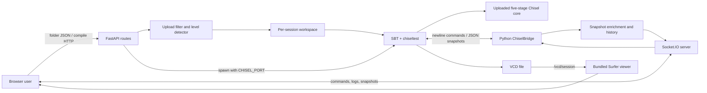

# Project Review: RISC-V Processor Debugging Environment

## Review scope and evidence

This review covers the repository root, with `web_demo.py` treated as the main application entry point. Generated artifacts, caches, and the bundled third-party Surfer implementation were identified but not analyzed line by line. It incorporates the subsequent provisioned-environment validation documented in `ENVIRONMENT_AND_VALIDATION.md`; the publication-ready synthesis is `RISCV_PIPELINE_VISUALIZER_REPORT.md`.

The following evidence labels are used:

- **Source-verified**: established by reading the checked-in implementation or configuration.
- **Execution-verified**: established by a non-destructive command in the current environment.
- **Interpretation**: a reasonable architectural conclusion that is not stated explicitly by the project.
- **Unverified**: not established by the source inspection or the recorded validation run.

## Purpose and scope

The project is an educational, browser-based debugging environment for student implementations of a five-stage, 32-bit RISC-V processor in Chisel. A user uploads the `src` directory of a course project. The backend filters the upload, infers a course architecture level from the submitted Scala sources, combines those sources with a controlled build and live testbench, and starts an SBT/Chisel simulation. The browser can then inspect source code, advance the simulated processor cycle by cycle, view the IF, ID, EX, MEM, and WB stages, inspect registers and hazard/forwarding indicators, read build and cycle logs, and open a generated VCD waveform in a bundled Surfer viewer. This purpose is **source-verified** in `web_visualizer/templates/index.html` (approximately lines 610–724) and in the compilation route in `web_visualizer/server.py` (approximately lines 426–646).

The system is more accurately described as a **simulation orchestrator and visual debugger** than as a Python RISC-V simulator. The processor behavior is supplied by the uploaded Chisel design and executed by `chiseltest`; Python manages sessions and transforms debug snapshots for the web client.

## Verified and inferred startup procedure

### Prerequisites

The review originally had to reconstruct dependencies from imports and SBT metadata. The repository now includes pinned `requirements.txt` and `requirements-docs.txt` files plus `scripts/setup.sh` and `scripts/run.sh`.

Required Python packages (**source-verified**):

| Import | Distribution to install | Role |
| --- | --- | --- |
| `uvicorn` | `uvicorn` | ASGI server |
| `fastapi` | `fastapi` | HTTP application, routing, static files |
| `socketio` | `python-socketio` | Socket.IO ASGI server and rooms |
| `pydantic` | `pydantic` | request models; normally installed through FastAPI |

Required simulation toolchain (**source-verified**):

- Java Development Kit, required by SBT and Scala. The repository does not state a version.
- SBT 1.9.7, pinned in `project/build.properties:1`.
- Scala 2.12.13, Chisel 3.5.0, and chiseltest 0.5.0, declared in `build.sbt:1–19`. SBT resolves these dependencies on the first build, so network access or a populated dependency cache is required.
- A modern browser with JavaScript. The page loads Socket.IO 4.6.0, JSZip 3.10.1, and Monaco Editor 0.36.1 from public CDNs (`web_visualizer/templates/index.html:7–13`), so an internet connection is required for the current UI unless those assets are already browser-cached.

The application was validated with Python 3.12.3. The exact installed Python package versions are pinned in the two requirements files. Other current Python 3 releases may work, but were not part of this validation.

### Clean-terminal commands

The following portable installation and launch procedure was executed successfully, including when invoked outside the repository directory.

```bash
git clone <repository-url>
cd RISCV-pipeline-vizualizer
./scripts/setup.sh
./scripts/run.sh
```

The scripts derive the repository path from their own location. Static and template paths are also source-relative, so launch no longer depends on the caller's working directory.

The entry point prints:

```text
🚀 Starting Web Visualizer at http://127.0.0.1:8080
```

Uvicorn reported successful startup at `http://127.0.0.1:8080`. On compile requests, the terminal printed the detected level, session/template paths, accepted Scala filenames, streamed SBT output, and `Connected to Hardware!`.

The safer default bind address is loopback; `--host` and `--port` permit an explicit override. The intended local browser address is:

```text
http://127.0.0.1:8080
```

No input file is needed merely to open the landing page. To enter the IDE, the user must upload a folder containing accepted Scala sources, normally `src/main/scala/*.scala`; Levels 1–3 additionally require a file named `PipelinedRISCV32I.scala` (`web_visualizer/server.py:344–424`). A file whose basename contains `BinaryFile` is optional at upload time. Despite UI wording such as “custom assembly,” this file must contain one 32-bit instruction word per line as hexadecimal text. No assembler is present.

### What was actually validated

- Python 3.12.3, Node.js 20.20.2, Temurin JDK 17.0.19+10, SBT 1.9.7, Scala 2.12.13, Chisel 3.5.0, and chiseltest 0.5.0 were used (**execution-verified**).
- All project Python sources compiled syntactically, and the browser JavaScript parsed successfully (**execution-verified**).
- The landing page, static SVG, and Socket.IO handshake returned HTTP 200; Playwright observed a connected socket with no JavaScript errors (**execution-verified**).
- Levels 1–4 compiled and connected to their Chisel testbenches. Their representative programs reached completion while snapshots were exported cycle by cycle (**execution-verified**).
- Browser stepping showed Level 2 forwarding at cycle 3, a Level 3 taken-branch flush at cycle 7, and a Level 4 load-use stall at cycle 41 (**execution-verified**).
- VCD download returned 312,820 bytes, and the bundled Surfer viewer rendered selected clock and debug signals (**execution-verified**).

### Common startup and run-time failures

| Symptom | Cause | Resolution |
| --- | --- | --- |
| `No module named 'uvicorn'` | Python dependencies absent | Activate the intended virtual environment and install the four distributions above. |
| `No module named 'socketio'` | Wrong/missing distribution | Install `python-socketio`, not the unrelated `socketio` distribution. |
| Static directory or `index.html` not found | Running an older revision with working-directory-relative paths | Use the current source and `scripts/run.sh`. |
| UI crashes at `socket` or editor/export is unavailable | CDN scripts blocked/offline | Permit the three pinned CDN assets or vendor them locally as a future improvement. |
| `[Errno 2] No such file or directory: 'sbt'` during Compile | SBT missing from `PATH` | Install SBT and a compatible JDK, then verify both commands. |
| First compilation is slow or dependency resolution fails | SBT must download Scala/Chisel dependencies | Provide network access or a pre-populated Ivy/Coursier cache. |
| Port 8080 already in use | Another service owns the default port | Run `./scripts/run.sh --port <free-port>` or invoke `web_demo.py` with the same option. |
| Chisel bridge times out | compilation failed, TCP test did not open, or a port/firewall issue occurred | Read the streamed SBT log; the backend waits up to 90 seconds and provides specialized messages for missing top-level classes/debug ports (`server.py:246–256`, `:592–622`). |
| VCD not found | compile/simulate has not completed or the expected filename was not generated | Compile first; `/vcd/{session_id}` searches the session test output for `PipelinedRV32I.vcd`. |

## System architecture

### Component overview

| Component | Primary files | Responsibility |
| --- | --- | --- |
| Application entry point | `web_demo.py` | Starts Uvicorn on port 8080 with the combined Socket.IO/FastAPI ASGI application. |
| HTTP and session orchestration | `web_visualizer/server.py` | Serves the UI and VCD; filters uploads; detects levels; stages per-session builds; launches SBT; owns session processes, bridges, history, and Socket.IO commands. |
| Chisel bridge | `web_visualizer/bridge.py` | Implements the newline-delimited command/JSON protocol over a local TCP socket and keeps a raw snapshot history. |
| Instruction decoder/enrichment | `live_debug/decoder.py`, `server.py:658–700` | Converts 32-bit instruction words to display strings, formats PCs, extracts register fields, and normalizes register snapshots. |
| Browser IDE and visualization | `web_visualizer/templates/index.html` | Landing/upload workflow, Monaco editor, compilation requests, cycle controls, SVG mutation, register display, console, ZIP export, and embedded Surfer. |
| Pipeline drawing and styles | `web_visualizer/static/pipeline.svg`, `style.css` | Stable SVG IDs for stage data, hazard badges, branch path, forwarding paths, and writeback path; base CSS. |
| Live Chisel protocol/testbench | `infrastructure_template/src/test/scala/LivePipelineTest.scala` | First generates a VCD, then exposes debug state as one JSON line per command over a session-specific TCP port. |
| Processor implementation/scaffold | `infrastructure_template/src/main/scala/*.scala` | Full five-stage reference architecture with control, forwarding, load-use stall handling, memory, and branch handling; also the Level 4 session template. |
| Course variants | `course_material/task3_level1`, `task4_level2`, `task5_level3_branch` | Skeleton/solution projects used to support progressively capable student designs; the solution directory supplies session build structure, but uploaded hardware replaces its `src/main/scala`. |
| System programs | `infrastructure_template/system_tests/level_1` … `level_4` | Raw hexadecimal instruction programs selected after level detection. |
| Local waveform viewer | `web_visualizer/static/surfer` | Bundled Surfer WASM web application that loads the generated VCD via HTTP. |
| Legacy terminal client | `live_debug/main.py`, `client.py`, `launcher.py`, `ui.py` | Separate terminal debugger for a fixed/default port; not imported or started by `web_demo.py`. |

### Proposed component diagram



This diagram is **source-verified in structure** but is a documentation abstraction rather than a generated dependency graph.

## Application execution flow

1. `web_demo.py` imports Uvicorn and starts `web_visualizer.server:socket_app` on all interfaces, port 8080 (`web_demo.py:1–7`). Importing `server.py` creates the FastAPI and asynchronous Socket.IO servers, mounts static/branding directories, registers routes/events, and wraps them as one ASGI application (`server.py:21–35`, `:186–191`).
2. `GET /` returns the single HTML application (`server.py:291–293`). The browser immediately loads Socket.IO, JSZip, and Monaco from CDNs and opens a Socket.IO connection (`index.html:7–13`, `:852–859`).
3. The initial page asks the user to choose a directory. Browser code reads only `.scala` files and a file ending in `BinaryFile`, normalizes the path from the first `src/` segment, and posts a filename-to-content map to `/upload_and_detect` (`index.html:1515–1550`).
4. The server rejects unsafe paths, generated/build paths, `build.sbt`, student tests, non-hardware Scala paths, and unrelated file types (`server.py:193–238`, `:344–376`). Duplicate Scala basenames are rejected because compilation flattens accepted files into one Scala directory (`:378–385`).
5. Level detection is heuristic and source-based (`server.py:258–289`): `Branch.scala` or memory/hazard marker files imply Level 4; branch/jump source markers imply Level 3; `ForwardingUnit.scala` implies Level 2; otherwise Level 1. The server returns the accepted source, the detected level, a system `BinaryFile`, and any uploaded custom `BinaryFile`.
6. The browser hides the landing page, populates its in-memory `codes` object, creates a Monaco editor and file tree, stores edits in `sessionStorage`, and lets the user choose the system or custom hexadecimal program (`index.html:1297–1372`, `:1553–1574`, `:1597–1609`).
7. “Compile & Simulate” posts Scala source, selected `BinaryFile`, and a browser session ID to `/compile` (`index.html:1455–1489`). Although the request includes `level`, the backend recalculates the level and ignores `req.level` (`server.py:447–460`).
8. The backend creates/reuses `temp_sessions/sess_<id>`, chooses a course solution scaffold for Levels 1–3 or `infrastructure_template` for Level 4, removes scaffold hardware/test code as appropriate, writes the uploaded Scala files into `src/main/scala`, installs the controlled `LivePipelineTest.scala`, and writes the selected `BinaryFile` (`server.py:462–536`).
9. A free local port is assigned in `CHISEL_PORT`; SBT is started as `sbt --batch "testOnly *LivePipelineTest"` in its own process group (`server.py:540–556`). Logs are streamed into the session's Socket.IO room. The test class first runs a headless simulation of at most 100 cycles with `WriteVcdAnnotation`, then starts its live TCP test (`LivePipelineTest.scala:12–38`).
10. The live test opens a server socket, emits an unsolicited cycle-zero JSON snapshot, waits for a command, advances/reset the clock, and then emits the next snapshot (`LivePipelineTest.scala:51–68`, `:105–235`). The backend connects a `ChiselBridge`, consumes the unsolicited snapshot, forces reset, enriches the resulting snapshot, and stores it as session history (`server.py:592–645`).
11. The browser sends `init`, `step`, `run` (the UI uses five cycles), `back`, or `reset` over Socket.IO. The backend either replays cached history or sends `step`/`reset` to Chisel, then broadcasts a processed snapshot and a concise cycle log (`server.py:704–810`).
12. The browser mutates text and styles inside `pipeline.svg`, updates all 32 registers, and displays forwarding, branch, stall, flush, memory, and writeback activity when the corresponding debug fields are present (`index.html:935–1292`). The Waveforms tab points the bundled Surfer iframe at `/vcd/<session>` (`index.html:1377–1400`).

## User workflow and controls

1. Open `http://localhost:8080`.
2. Upload the processor project's `src` folder. Accepted hardware is normally under `src/main/scala`; student tests are deliberately ignored.
3. Review the detected level and files in the Monaco editor. Edits remain browser-side until compilation and are cached in `sessionStorage`.
4. Choose **System Testbench** or **My Custom Assembly**. Technically, both choices select hexadecimal `BinaryFile` content; assembly mnemonics are not assembled.
5. Select **Compile & Simulate**. SBT output appears in the console; successful compilation switches to the pipeline view.
6. Use **Restart** (hardware reset/cycle zero), **Back** (move backward in cached snapshots), **Step** (one cycle), or **Fast** (five cycles). Left/right arrow keys duplicate Back/Step.
7. Use the tabs for **Code Editor**, **Pipeline Visualizer**, and **Waveforms**. “Show Hazards” controls hazard/branch annotations. The “Datapath” checkbox triggers redraw but is not consulted by `updateSVG`, so it presently has no visible implementation effect.
8. **Export** creates `updated_riscv_project.zip` from the browser's current `codes` object using JSZip. **Upload New Code** returns to the landing screen and clears browser storage after confirmation.

Important semantics:

- **Back does not reverse Chisel hardware.** It moves a cursor through immutable cached snapshots. Subsequent Step first moves forward through existing history; only after reaching the latest snapshot does hardware advance (`server.py:741–762`).
- Leaving for the landing page does not notify the backend to terminate the SBT session. Backend cleanup occurs when recompiling the same session or shutting down Uvicorn (`server.py:158–189`, `:465–470`).
- Files in `temp_sessions` are not deleted by session cleanup. They are ignored by Git and may remain after shutdown.

## Pipeline model

### Five-stage organization

The full infrastructure implementation instantiates five combinational/functional stages and five barriers (`infrastructure_template/src/main/scala/core.scala:82–99`):

- **IF** maintains the program counter, selects sequential `PC + 4` or a branch/jump target, and reads instruction memory (`PipelineStages.scala:16–42`).
- **ID** extracts `rd`, `rs1`, and `rs2`, reads two register operands, and generates an immediate (`PipelineStages.scala:49–87`). `ControlUnit` derives ALU, memory, writeback, and operand-select control signals.
- **EX** selects forwarded/immediate/PC operands, performs the ALU operation, and evaluates control transfer (`PipelineStages.scala:93–133`).
- **MEM** performs word-addressed data-memory access through `MemController` (`PipelineStages.scala:139–159`; `MemController.scala:22–48`).
- **WB** selects memory or ALU data and writes the register file (`PipelineStages.scala:165–183`). Register x0 is forced to zero in `RegFile.scala`.

Pipeline barrier registers preserve each instruction and PC for display and carry control/data forward. IF/ID can hold its state on a stall. ID/EX injects a NOP and neutral control values on a load-use stall or flush (`PipelineRegisters.scala:15–49`, `:54–171`).

### Supported behavior varies by uploaded course design

The visualizer does not enforce one fixed ISA. It compiles the user's modules, so supported instructions and hazards depend on the detected course level and uploaded implementation.

- The Level 1/Task 3 reference implements a five-stage arithmetic pipeline without forwarding. Its source and sample program cover RV32I register-register arithmetic/logical/shift/compare operations and immediate arithmetic variants; test programs insert NOPs around dependencies.
- The Level 2/Task 4 reference adds MEM- and WB-to-EX forwarding (`course_material/task4_level2/solution/src/main/scala/ForwardingUnit.scala`). Its system program intentionally chains dependent arithmetic instructions.
- The Level 3/Task 5 reference adds conditional branches and JAL/JALR, resolves them in EX, redirects fetch, and flushes younger IF/ID instructions (`task5_level3_branch/solution/src/main/scala/EXstage.scala` and `core.scala:134–169`). Despite the current landing-page label “Memory,” backend Level 3 is the branch/jump task.
- The Level 4 infrastructure integrates arithmetic, `LW`/`SW`, forwarding, a load-use interlock, and control flow. Its `ControlUnit` implements word loads/stores only; `BranchCheck` implements BEQ and BNE only. The Python display decoder recognizes a wider set (byte/halfword loads/stores and all six RV32I branch mnemonics), but recognition in the UI must not be mistaken for hardware support.

The Level 4 ALU source has two implementation caveats worth disclosing: `SRA` uses a logical `UInt` shift rather than converting to signed first, and `SLT` compares `UInt` operands. The course Task 3–5 ALU solutions use signed conversion for these operations. Therefore the full infrastructure's signed SRA/SLT behavior should be tested before it is described as ISA-conformant.

### Hazards, forwarding, stalls, and control flow

- **Forwarding:** the full `ForwardingUnit` checks whether the EX instruction's source registers match writing destination registers in MEM or WB, gives MEM priority, ignores x0, and selects forwarded values (`ForwardingUnit.scala:28–74`; `core.scala:142–168`). The web debug selectors use `0 = register operand`, `1 = MEM`, and `2 = WB` for visualization.
- **Load-use stall:** `HazardDetectionUnit` compares an instruction in ID with a load in EX. On a dependency it holds PC/IF, marks ID stalled, and injects a bubble into ID/EX (`HazardDetection.scala:19–42`; `core.scala:101–135`).
- **Branches/jumps in the full infrastructure:** `BranchCheck` evaluates BEQ/BNE and calculates JAL/JALR/branch targets in EX. A taken transfer redirects the PC and asserts flush for two cycles (`Branch.scala:24–46`). IF/ID and ID/EX replace flushed instructions with NOPs.
- **Task 5 control flow:** the course branch solution supports the six RV32I conditional branches plus JAL/JALR and flushes IF/ID when EX asserts redirect. It has forwarding but no memory implementation in its debug bus.
- **Termination:** the full model treats opcode `0x73` as the end-of-test signal (`HazardDetection.scala:44–51`); the system `BinaryFile` ends with `00100073` or `00000073`. The decoder renders these words as `unknown` because system/CSR opcodes are intentionally outside its displayed RV32I subset.

### Snapshot data model

Each live snapshot includes cycle number, ROM contents at cycle zero, termination/result values, all 32 registers, stage PCs and instruction words, decode register identifiers, hazard flags, forwarding selectors, EX operands/results/control, MEM activity, and WB activity (`LivePipelineTest.scala:105–182`).

`process_snapshot` deep-copies this raw object, adds disassembly and zero-padded hexadecimal PCs for all five stages, adds EX operand aliases and ID register fields, and converts the register map to a 32-entry list (`server.py:658–693`). The browser receives:

```text
{ raw: <testbench JSON>, enriched: <display-ready state>, registers: [x0 ... x31] }
```

Session state is held in the process-local `active_sessions` dictionary as the SBT process handle, TCP bridge, processed snapshot history, and current cursor (`server.py:60`, `:634–639`). It is not persisted across backend restarts.

## Important implementation details and limitations

### Robust or intentional design choices

- Upload paths are normalized and checked for traversal, absolute paths, build outputs, test sources, and unexpected extensions.
- Student `build.sbt` and tests are not trusted; the platform controls the build and live testbench.
- Each compile uses a dynamically allocated TCP port and an isolated `temp_sessions/sess_*` directory.
- SBT output is streamed to a private Socket.IO room and absolute session paths are replaced with `[WORKSPACE]` in client-visible logs.
- The backend tracks the exact process it started and terminates its process group on recompile or shutdown.
- The VCD route validates session IDs and searches only under that session's test output.

### Current limitations and risks

- There is no dependency manifest or top-level README for the web application, so installation is not reproducible and versions may drift.
- The frontend has mandatory CDN dependencies. A disconnected lab environment cannot load the main Socket.IO client or Monaco/JSZip.
- Uvicorn binds to all interfaces, FastAPI CORS and Socket.IO origins are unrestricted, there is no authentication, and uploaded Scala is compiled/executed. The application should be treated as a trusted teaching-lab tool, not an internet-facing service.
- Compilation executes resource-intensive SBT processes without quotas, request size limits, timeouts for the entire build, or per-user authentication.
- A browser leaving a page does not stop its backend simulation; session directories are not removed automatically.
- The `req.level` field is unused. Auto-detection relies on filenames and string markers, so unusual valid implementations can be misclassified.
- Course nomenclature is inconsistent: backend Level 3 is branch/jump, while current landing labels Level 3 “Memory” and Level 4 “Branches.”
- The UI calls `BinaryFile` content “assembly,” but accepts raw machine-word hex only.
- The “Datapath” checkbox has no implemented effect. `active_bridges`, global `debug_state`, and `LEVEL_MARKER_FILES` are unused.
- `web_visualizer/static/client.js` duplicates older portions of the inline script but is never loaded by `index.html`; the inline script is authoritative.
- `GET /workspace` points at nonexistent `infrastructure_template/level_<n>` directories and is not called by the current upload-first UI. It appears obsolete/incomplete.
- The Python decoder omits immediate shifts and SLTI/SLTIU, reports the `0x73` terminator as `unknown`, and recognizes some memory/branch instructions that particular cores do not implement.
- Branch display logic recomputes taken/not-taken in JavaScript from operand values and decoded text rather than displaying the hardware's `pc_src` directly; unsigned BLTU/BGEU are not handled in this UI recomputation.
- SBT runs both tests in `LivePipelineTest`: VCD generation is capped at 100 cycles, so longer programs can have a truncated waveform even though live stepping can continue.
- Socket operations such as `bridge.step` are blocking calls inside an asynchronous event handler. A slow/broken bridge may delay other Socket.IO work until the socket timeout.

### Obsolete, duplicated, experimental, or non-entry-point material

- `live_debug/*` is a separate terminal UI and launcher. Only `live_debug.decoder.decode_rv32i` is reused by the web application.
- `web_visualizer/static/client.js` is unused and duplicates older browser logic now embedded in `index.html`.
- `images/rv32core_uvm_tb.png` describes a UVM-style testbench that is not part of the Python/Chisel web execution path; it should not be used to explain this application.
- `images/processor_architecture.png` is a useful conceptual diagram for the full infrastructure but is not generated from the current code and is denser than the browser SVG.
- Skeleton and solution course directories are intentional teaching/reference variants, not duplicate production implementations. For web compilation, solution folders mainly provide build scaffolding; uploaded `src/main/scala` replaces the reference hardware.
- `riscv-tests_modified_files` is an external test-suite patch workflow. It is not invoked by `web_demo.py` or the web compile route.
- `.bsp/sbt.json` is IDE metadata. Root `build.sbt` supports local Scala work but web sessions build from copied templates.
- `web_visualizer/static/landing/Screenshot_2026-06-17_17-34-22.png` shows an older title/text and should be recaptured before final publication. `landing-preview.png` is a useful existing pipeline illustration.

## Tests and validation assets

The repository contains Scala/chiseltest suites in each course skeleton/solution and the controlled `LivePipelineTest`. The course suites test arithmetic, forwarding, and branch behavior with cycle-level expectations. There are no Python backend tests, frontend unit/end-to-end tests, API tests, or automated level-detection/path-safety tests.

The provisioned validation exercised the complete path from HTTP upload through SBT/chiseltest and the TCP bridge to browser rendering. Representative programs for Levels 1–4 reached `coreDone`; raw snapshots and cycle/event summaries are retained in `assets/data/`. The browser captures and waveform view are retained in `assets/screenshots/`. Concurrently compiling several sessions can retain substantial JVM memory and delay later jobs, so this is a resource-scaling concern rather than a functional validation target.

## Useful demonstration programs

The existing system programs are the safest reproducible figure inputs:

- **Forwarding:** `infrastructure_template/system_tests/level_2/BinaryFile` starts with `addi x1,x0,5; add x2,x1,x1; add x3,x2,x1; addi x4,x3,7`. This creates easily explained back-to-back RAW dependencies and should activate forwarding without NOPs.
- **Branch flush:** `system_tests/level_3/BinaryFile` includes a not-taken `beq x1,x3,+12`, followed by a taken `beq x1,x2,+12`. A screenshot around the taken branch should show the redirect/flush.
- **Load-use stall and full datapath:** the Level 4 program produced four stall cycles; the captured cycle 41 shows `lw x26,12(x0)` in EX, the dependent `add x27,x26,x25` in ID, `pc_write = 0`, and an IF/ID stall (**execution-verified**).

## Open questions before a final report

1. Which Python, JDK, and OS versions should be declared officially supported beyond the validated environment?
2. Is the report intended to describe the upload/visualization platform, the full Level 4 processor, or all course levels equally?
3. Are “Level 3 Memory / Level 4 Branches” UI labels intentional, or should they match the backend's Task 5 branch Level 3 and full infrastructure Level 4 mapping?
4. Should a `BinaryFile` be described explicitly as hexadecimal machine code in student-facing documentation?
5. Should CI automate the now-recorded Level 1–4, browser, and VCD validation scenarios?
6. Are the institutional logos and the named supervisor approved for publication in the report?
