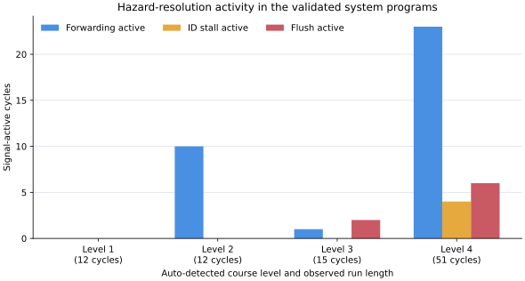

# Architecture and Operation of a Web-Based RISC-V Pipeline Debugging Environment

## Abstract

This report presents an educational debugging environment for five-stage RISC-V processors implemented in Chisel. The system combines a browser-based source editor and pipeline display with a Python ASGI backend and a controlled SBT/chiseltest simulation process. A student uploads a processor source tree; the backend filters the files, infers the applicable course level, creates an isolated session workspace, and launches a live Chisel testbench. Cycle commands are exchanged through a local TCP bridge, while processed processor snapshots and build logs are delivered to the browser through Socket.IO. The resulting interface exposes stage instructions, program counters, register values, forwarding selections, stalls, flushes, memory activity, and VCD waveforms. Installation and operation were validated on Python 3.12, JDK 17, and SBT 1.9.7. Reference designs for all four detected levels compiled and executed successfully. Observed runs confirmed arithmetic forwarding, branch flushing, load-use stalls, VCD generation, and Surfer integration. The review also identifies reproducibility, level-classification, resource-management, and security limitations relevant to future development.

## 1. Introduction and motivation

A pipelined processor is difficult to debug from final register values alone. Several instructions occupy different stages simultaneously, and a fault observed during writeback may have originated in decode, forwarding, control selection, or an earlier pipeline register. Waveforms provide complete signal-level evidence, but they can be demanding for students who are still learning the relation between an instruction stream and the microarchitecture. The project addresses this gap by combining source code, a cycle-level pipeline diagram, registers, concise logs, and a conventional VCD viewer in one browser workspace.

The system targets university course designs written in Chisel. Its scope must be stated precisely: Python does not emulate the RISC-V core. Python serves the application, prepares simulation workspaces, starts and controls external processes, and transforms debug data. The uploaded Chisel model is executed by `chiseltest`; the browser presents the resulting state. Accordingly, instruction support and processor correctness depend on the uploaded implementation, whereas upload handling, session control, and visualization belong to the platform.

This report is based on source inspection and execution at Git revision `02e87a0` with the documented working-tree portability additions. Statements about structure are source-verified. Statements about startup, compilation, cycle behavior, screenshots, and waveforms are execution-verified unless explicitly identified as limitations.

## 2. Quick setup and first startup

### 2.1 Prerequisites

The validated environment is summarized in Table 1. Python runtime dependencies are pinned in `requirements.txt`. Scala and Chisel versions remain those declared by the repository.

**Table 1. Validated runtime and build versions.**

| Component | Validated version | Source of version |
| --- | --- | --- |
| Operating system | Ubuntu 24.04.4 LTS, x86-64 under WSL2 | Execution environment |
| Python | 3.12.3 | Execution-verified |
| FastAPI / Uvicorn | 0.139.2 / 0.51.0 | `requirements.txt` |
| Python Socket.IO / Pydantic | 5.16.3 / 2.13.4 | `requirements.txt` |
| JDK | Eclipse Temurin 17.0.19 | Execution-verified |
| SBT | 1.9.7 | `project/build.properties` |
| Scala | 2.12.13 | `build.sbt` |
| Chisel / chiseltest | 3.5.0 / 0.5.0 | `build.sbt` |
| Browser automation | Playwright 1.61.0, Chrome 149.0.7827.55 | Documentation environment |

Python 3.12 is execution-verified; other Python versions have not been tested in this review. A JDK and SBT must be available before a processor is compiled. The first SBT invocation downloads the declared Scala, Chisel, compiler-plugin, and test dependencies. The current page also obtains Socket.IO 4.6.0, Monaco Editor 0.36.1, and JSZip 3.10.1 from public content-delivery networks, so an offline browser requires those resources to be vendored or cached.

### 2.2 Portable installation

From a newly cloned repository, the basic procedure is:

```bash
git clone <repository-url>
cd RISCV-pipeline-vizualizer

python3 -m venv .venv
source .venv/bin/activate
python -m pip install -r requirements.txt

java -version
sbt --script-version
python web_demo.py
```

The equivalent helper workflow is `scripts/setup.sh` followed by `scripts/run.sh`. Both scripts locate the repository from their own path, so they do not embed a developer directory. They use system Java/SBT when available and also recognize optional local installations in ignored `.tools/jdk` and `.tools/sbt` directories.

The validated default is a local-only listener at `127.0.0.1:8080`, opened in the browser as <http://localhost:8080>. A different interface or port can be selected explicitly:

```bash
python web_demo.py --host 0.0.0.0 --port 8080
```

Binding to all interfaces should be intentional because the application accepts source code and starts compiler processes. During validation, startup produced the application URL followed by Uvicorn's “Application startup complete” and “Uvicorn running on http://127.0.0.1:8080” messages. Requests to `/`, `/static/pipeline.svg`, and the Socket.IO polling endpoint all returned HTTP 200. The server also started successfully through `scripts/run.sh` when the caller's working directory was outside the repository, confirming source-relative static/template path resolution.


**Figure 1. Current landing interface for selecting a Chisel source tree.** The screenshot was captured at 1440 × 900 pixels with no user account, machine name, or personal browser data visible.

## 3. Basic user workflow

The initial page asks the user to select a project `src` directory. Browser code reads Scala files and any file ending in `BinaryFile`, then sends their relative names and contents to `/upload_and_detect`. The server rejects absolute or traversing paths, generated directories, student test sources, uploaded build definitions, and unrelated files. It flattens accepted Scala sources into the controlled session layout; duplicate basenames are rejected to prevent silent overwriting.

Level detection is heuristic. A basic arithmetic design is Level 1; the presence of `ForwardingUnit.scala` identifies Level 2; branch/jump markers identify Level 3; and `Branch.scala`, `HazardDetection.scala`, or `MemController.scala` identify the integrated Level 4 design. The server returns the accepted sources and the system test program for that level. Levels 1–3 must include `PipelinedRISCV32I.scala`.

After upload, the user can inspect and edit accepted files in Monaco Editor. Edits are held in a browser-side `codes` object and cached in `sessionStorage`. The test selector switches between the system test and the uploaded `BinaryFile`. Although the UI uses the phrase “custom assembly,” `BinaryFile` is hexadecimal machine code: each non-empty line is one 32-bit instruction word. No assembler is included.

Selecting **Compile & Simulate** submits the current source and test program. Successful compilation opens the pipeline view. **Step** advances one simulated cycle; **Fast** advances five; **Restart** resets the hardware; and **Back** moves the display cursor through cached snapshots. Back does not reverse the Chisel model. A later Step first replays cached forward history and advances hardware only after the newest snapshot is reached. The remaining views provide the source editor, dynamic pipeline/register display, build and cycle console, and embedded Surfer waveform viewer. **Export** creates a ZIP archive in the browser from the current edited files.

## 4. High-level system architecture

The application spans three execution contexts: the browser, the Python server, and a per-session JVM simulation. Figure 2 summarizes their responsibilities and communication paths.


**Figure 2. Component architecture of the debugging environment.** HTTP carries upload/compile requests and VCD downloads; Socket.IO carries session commands, logs, and display updates; a local TCP connection carries commands and raw JSON snapshots between Python and the Chisel testbench.

`web_demo.py` starts Uvicorn with the combined ASGI object. `web_visualizer/server.py` creates FastAPI and Socket.IO instances, serves static resources, validates request models, owns active sessions, and coordinates subprocess cleanup. `web_visualizer/bridge.py` implements the newline-oriented TCP client. Its commands include `step` and `reset`; every command is followed by one JSON snapshot from Chisel.

The browser application is primarily contained in `web_visualizer/templates/index.html`. It performs folder selection, API requests, source editing, Socket.IO control, and DOM updates within `web_visualizer/static/pipeline.svg`. Stable SVG identifiers represent stage text, forwarding paths, hazard badges, the branch redirect, register-file activity, and writeback. The bundled WASM build under `web_visualizer/static/surfer/` loads a session VCD through `/vcd/<session-id>`.

For compilation, the backend chooses a controlled scaffold. Levels 1–3 use the appropriate course solution directory for build structure, after which the reference hardware and tests are removed and replaced by uploaded hardware plus the platform's `LivePipelineTest.scala`. Level 4 uses `infrastructure_template/`. Each run receives an isolated `temp_sessions/sess_*` workspace and dynamically selected TCP port.

## 5. Five-stage RISC-V pipeline background

The integrated reference core follows the conventional instruction fetch (IF), instruction decode (ID), execute (EX), memory (MEM), and writeback (WB) organization shown in Figure 3. Pipeline registers separate adjacent stages, allowing up to five different instructions to be processed concurrently.


**Figure 3. Simplified five-stage datapath and hazard-control paths.** Dashed paths forward results to EX; a load-use detector holds fetch/decode and inserts a bubble; a taken branch or jump redirects fetch and flushes younger instructions.

In the full infrastructure, IF maintains the program counter and obtains a word from instruction memory. ID extracts register indices, reads two operands, generates immediates, and derives control signals. EX selects register, immediate, PC, or forwarded operands and applies the ALU; it also resolves branches and jumps. MEM accesses a word-addressed data memory. WB selects memory or ALU data and writes the 32-entry register file, with x0 held at zero. Explicit barrier registers retain each stage's instruction and PC so the visualization can associate data with the correct cycle.

The supported processor features vary by course level and uploaded design. The supplied Level 1 reference implements the RV32I register-register and immediate arithmetic subset without hazard resolution, so independent instructions or inserted NOPs are required. Level 2 adds MEM/WB forwarding. Level 3 adds the six conditional branches and JAL/JALR with an always-not-taken control policy and EX-stage redirect. Level 4 integrates arithmetic, forwarding, word loads/stores, a load-use interlock, and a smaller branch implementation in the separate infrastructure design. A mnemonic recognized by the Python display decoder is not evidence that every uploaded core implements that instruction.

## 6. Detailed execution and data flow

Figure 4 traces a request from upload to one displayed cycle. The compile request is deliberately synchronous from the browser's perspective, while build logs are streamed concurrently to the session's Socket.IO room.


**Figure 4. Sequence from source upload to a browser pipeline update.** A headless test generates the VCD before the interactive TCP test accepts the Python bridge.

The `/compile` handler revalidates paths and recalculates the level; the `level` value sent by the browser is not authoritative. It copies the selected scaffold, writes accepted hardware to `src/main/scala`, writes the chosen `BinaryFile`, allocates a TCP port in `CHISEL_PORT`, and starts:

```text
sbt --batch testOnly *LivePipelineTest
```

`LivePipelineTest.scala` contains two tests. The first runs until the core's termination signal or 100 cycles and writes `PipelinedRV32I.vcd`. The second opens a server socket and emits the processor's debug state as a single JSON object per line. At cycle zero the object includes the test ROM; every snapshot contains all 32 registers, stage PCs and instructions, decode indices, forwarding selectors, stall/flush flags, EX/MEM/WB summaries, result state, and termination status.

Python consumes the unsolicited initial snapshot, resets the core to synchronize the protocol, and enriches each subsequent object. `process_snapshot` adds display mnemonics using `live_debug/decoder.py`, formats PCs, extracts ID register indices, normalizes operands, and converts the register map into a list. The active session stores the SBT process, bridge, processed-history list, and display cursor. A browser Step either selects the next cached item or sends `step` to Chisel. The server broadcasts the processed packet and a one-line execution summary to the session room; the browser then mutates SVG text/styles and the register grid.

The VCD route validates the session identifier and searches only within the corresponding session test directory. In the Level 4 validation it served a 312,820-byte VCD. Surfer loaded this file successfully and displayed stable top-level and `io.dbg` signals (Figure 9 below).

## 7. Hazard handling, forwarding, stalls, and branches

### 7.1 Data forwarding

A read-after-write dependency occurs when an instruction needs a register result that has not yet reached WB. In Level 2 and later reference designs, a forwarding unit compares EX source registers with writing destinations in MEM and WB, ignores x0, prioritizes the newer MEM value, and selects a bypassed operand. The Level 2 system program intentionally begins with dependent operations. At cycle 3, `add x2,x1,x1` is in EX while `addi x1,x0,5` is in MEM; both EX operands select the MEM result and the ALU produces 10.


**Figure 5. Execution-verified forwarding in Level 2 at cycle 3.** The blue forwarding paths and `FWD A:1 B:1` label show both operands sourced from the MEM result.

### 7.2 Load-use stalls

Forwarding cannot supply a loaded value to the immediately following EX operation because the memory result is not available early enough. The integrated hazard detector compares the ID sources with the destination of a load in EX. On a match it disables PC writing, holds IF/ID, and inserts neutral control plus a NOP into ID/EX. At Level 4 cycle 41, `lw x26,12(x0)` is in EX and `add x27,x26,x25` is in ID. Recorded flags are `pc_write=0`, `if_stall=1`, and `id_stall=1`.


**Figure 6. Execution-verified Level 4 load-use interlock at cycle 41.** IF and ID are held while the dependent load advances, after which the add can receive the value.

### 7.3 Branch redirect and flush

The Level 3 course core assumes conditional branches are not taken and resolves them in EX. A taken condition redirects the fetch PC and converts younger instructions in IF/ID and ID/EX into bubbles. At cycle 7, `beq x1,x2,+12` compares two values of 5, redirects to address `0x20`, and asserts the debug flush flag.


**Figure 7. Execution-verified taken BEQ and flush in Level 3 at cycle 7.** The target path is highlighted and the younger IF and ID instructions are marked for flushing.

## 8. Demonstration and observations

All four supplied solution/infrastructure source trees were submitted through the same filtering and level-detection API, compiled with the controlled live testbench, and stepped from cycle zero until the first observed `coreDone`. This stop condition is asserted when the termination opcode reaches fetch; it does not represent a fully drained pipeline and must not be interpreted as retired-instruction CPI.

**Table 2. Execution-verified activity in the supplied system programs.**

| Detected level | Final observed cycle | Forwarding-active cycles | ID-stall cycles | Flush cycles | Test result |
| --- | ---: | ---: | ---: | ---: | --- |
| 1 | 12 | 0 | 0 | 0 | Compiled, stepped, terminator observed |
| 2 | 12 | 10 | 0 | 0 | Compiled, stepped, terminator observed |
| 3 | 15 | 1 | 0 | 2 | Compiled, stepped, terminator observed |
| 4 | 51 | 23 | 4 | 6 | Compiled, stepped, terminator observed |



**Figure 8. Signal-active cycle counts in the validated system programs.** Counts are derived directly from exported snapshots from cycle zero through the first `coreDone`. Programs and run lengths differ, so the graph demonstrates which mechanisms were exercised; it is not a performance comparison between levels.

Raw snapshots, compact CSV cycle tables, the aggregation script, and the plot source are stored under `docs/report/assets/data/` and `docs/report/assets/source/`. A forwarding cycle counts a snapshot in which either forwarding selector is nonzero; a stall or flush cycle counts a snapshot in which the corresponding debug flag is asserted. No processor instrumentation or semantic change was required.


**Figure 9. Generated Level 4 VCD loaded in the bundled Surfer viewer.** The visible trace includes clock and processor debug signals, confirming the HTTP VCD path and WASM viewer integration.

## 9. Limitations and possible improvements

The new manifests and source-relative paths improve setup, but several limitations remain:

- Frontend libraries are fetched from CDNs. Vendoring versioned Socket.IO, Monaco, and JSZip assets would permit repeatable offline teaching-lab deployment.
- Level detection uses filenames and source-string markers rather than an explicit project manifest. A small declarative course-level file would be clearer and less prone to misclassification. The current landing labels also describe Level 3 as memory and Level 4 as branches, whereas backend Level 3 is the branch/jump course design and Level 4 is the integrated memory/hazard design.
- The request model contains a level field that compilation ignores. Removing it or documenting the server as authoritative would avoid ambiguity.
- The browser calls a hexadecimal `BinaryFile` “assembly.” Either the terminology should change or a real assembler stage should be added.
- Active simulations are stopped on recompilation or server shutdown, but leaving the page does not terminate a session and session directories remain on disk. A disconnect/close-session protocol and retention policy would reduce resource use.
- The server compiles uploaded Scala, permits unrestricted CORS/origins, and has no authentication, quotas, or sandbox. The default local-only bind reduces exposure, but multi-user or network deployment requires isolation and access control.
- The “Datapath” checkbox does not currently affect SVG rendering. `GET /workspace` points to template paths that do not exist in the present layout, and the unused `web_visualizer/static/client.js` duplicates older inline logic.
- Browser Socket.IO calls eventually invoke blocking bridge reads inside an asynchronous handler. Moving bridge I/O to a worker or async stream would prevent a slow session from delaying other clients.
- Debug-display decoding and core instruction support are not identical. In addition, the integrated infrastructure should receive dedicated ISA tests for signed `SRA` and `SLT`, whose current unsigned Chisel expressions differ from the course ALU implementations. These processor concerns were reported but not modified.
- Web routes, path filters, classification, session lifecycle, and browser behavior lack automated unit/end-to-end tests. The validation utility created for this report could form the basis of a regression test, provided resource cleanup is added.

## 10. Conclusion

The project provides a coherent bridge between student-written Chisel processors and an accessible cycle-level debugging interface. Its central design is a division of responsibility: FastAPI and Socket.IO manage web interaction and sessions, SBT/chiseltest executes the uploaded processor, a TCP bridge transfers raw state, and the browser turns that state into pipeline, register, log, and waveform views. The validated setup successfully started from portable commands, detected and compiled all four reference levels, advanced their pipelines, and exposed forwarding, stalls, branches, and VCD data without modifying processor semantics. The most important next steps are to make frontend resources offline-reproducible, replace heuristic level naming with explicit metadata, improve session cleanup and isolation, and add automated regression coverage. Within a trusted teaching environment, the current implementation already demonstrates the essential mechanisms needed to connect source-level processor work with observable pipeline behavior.

## Repository references

- `web_demo.py` — Uvicorn entry point and host/port options.
- `web_visualizer/server.py` — routes, filtering, sessions, SBT orchestration, snapshot processing, and Socket.IO commands.
- `web_visualizer/bridge.py` — live TCP command/snapshot bridge.
- `web_visualizer/templates/index.html` — browser workflow and dynamic visualization logic.
- `web_visualizer/static/pipeline.svg` — semantic five-stage display.
- `infrastructure_template/src/test/scala/LivePipelineTest.scala` — VCD and interactive testbench.
- `infrastructure_template/src/main/scala/` — integrated processor implementation.
- `course_material/` — Level 1–3 course skeletons and solutions.
- `docs/report/ENVIRONMENT_AND_VALIDATION.md` — exact installation and validation record.

## Markdown-to-LaTeX conversion considerations

The Mermaid diagrams have already been exported as SVG. If the selected LaTeX workflow lacks native SVG support, convert them to PDF while retaining the `.mmd` and SVG masters. The event graph is available as both SVG and PDF; the PDF is preferred for LaTeX. Browser evidence remains PNG. Tables may need `longtable` only if environment details are included in the main document; the present report tables should fit standard page width after column adjustment. Short command blocks can use `listings`; syntax-highlighted code images are unnecessary. A final bibliography should use the citation format required by the course and include the RISC-V specification, Chisel documentation, FastAPI, Socket.IO, SBT, and Surfer where external references are desired.
