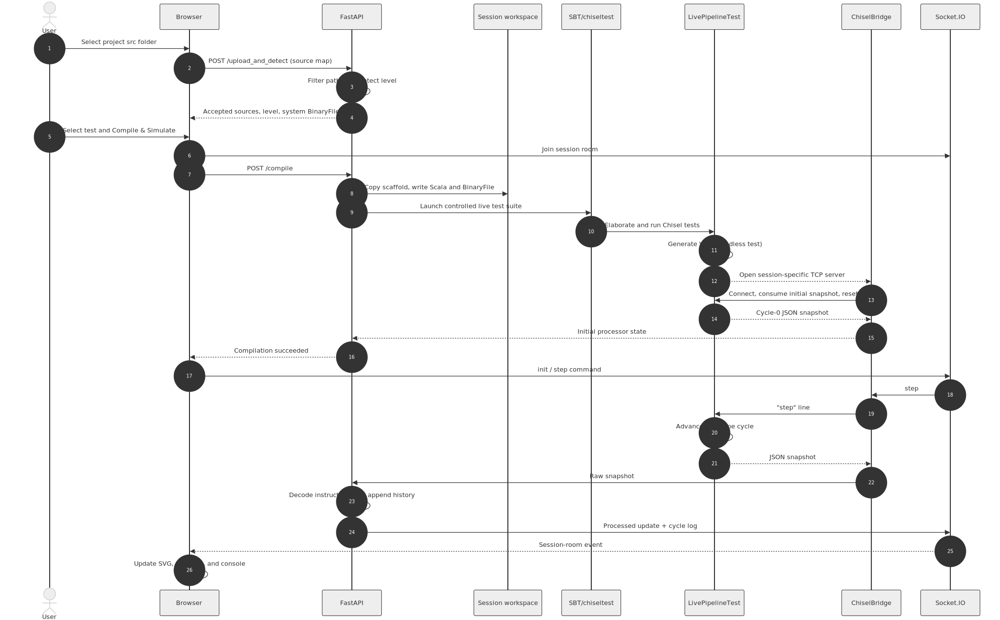
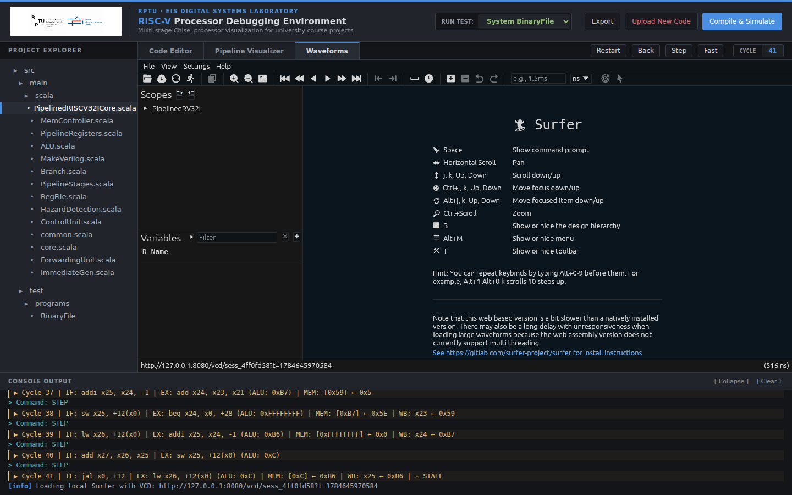
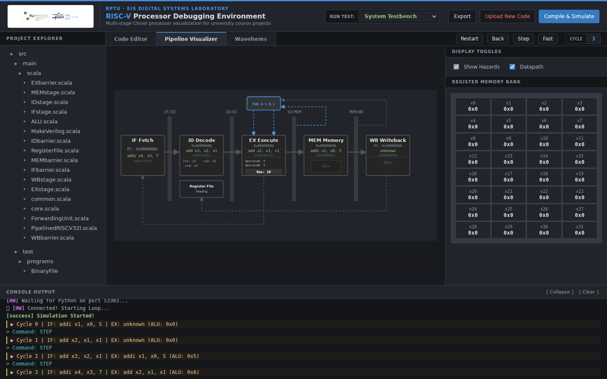
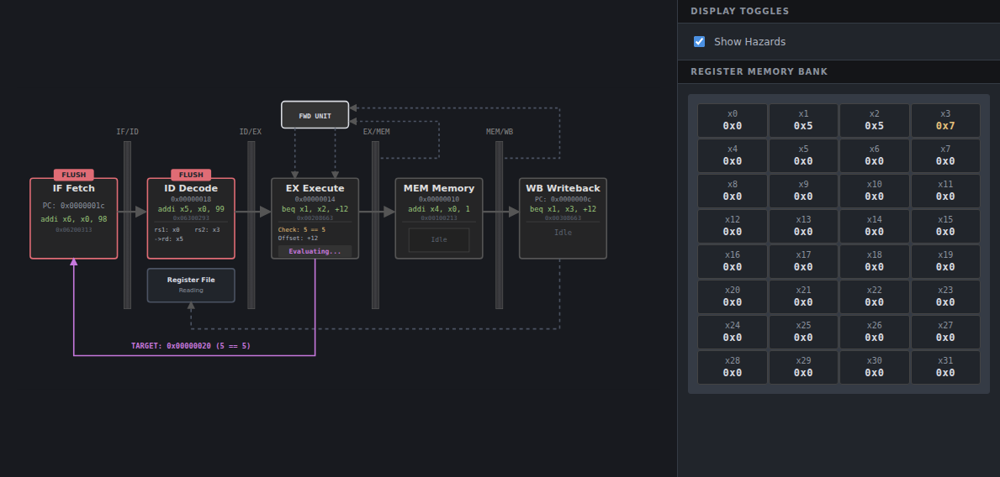
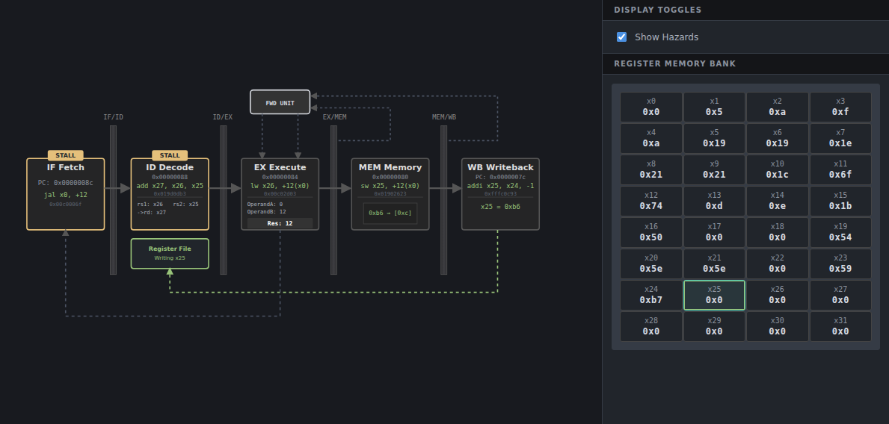

# Architecture and Operation of a Web-Based RISC-V Pipeline Debugging Environment

**Master Project**

**Author:** Joel Agustín Sanchez

**Supervisor:** [M.Sc. Tobias Jauch](https://eit.rptu.de/fgs/eis/people/jauch) (PhD student)

**Chair:** [LEHRSTUHL FÜR ENTWURF INFORMATIONSTECHNISCHER SYSTEME / CHAIR OF ELECTRONIC DESIGN AUTOMATION](https://eit.rptu.de/fgs/eis)

**Submission date:** 23 July 2026

## Abstract

This report presents a browser-based environment for teaching and debugging a five-stage RISC-V processor written in Chisel. The application connects an editable view of a student's processor sources to a controlled chiseltest simulation and displays the resulting instruction flow, registers, hazard signals, logs, and waveform data. A Python service manages uploads and isolated session workspaces, while a small TCP bridge exchanges cycle commands and JSON snapshots with the Scala testbench. The design gives students a concrete view of forwarding, stalls, and control-hazard recovery without replacing the processor implementation that they are expected to develop. The report explains installation, classroom use, system structure, representative behavior, and the principal maintenance points. The four supplied reference levels were tested through the complete upload, compilation, and simulation workflow on Ubuntu 24.04 under WSL2 with Python 3.12, JDK 17, and SBT 1.9.7. The current deployment target is a trusted local teaching environment.

## 1. Introduction and motivation

Pipelining is often introduced as a timing diagram, yet the most difficult errors arise where several representations meet: an instruction encoding, a register-transfer implementation, control signals, and state that changes on a clock edge. A source-level simulator alone does not show these relationships well. Conversely, a conventional waveform viewer is precise but can overwhelm a student who has not yet learned which signals matter. The RISC-V Pipeline Visualizer combines these views around the familiar five-stage pipeline and keeps the student's Chisel sources in the same workflow.

The system is intended for a staged processor-design course. It detects the uploaded project level and presents the corresponding teaching description: Level 1 — Basic arithmetic pipeline; Level 2 — Data forwarding; Level 3 — Branches and jumps; and Level 4 — Integrated memory and hazard handling. These names describe the course progression, not a guarantee that every uploaded core implements an identical RV32I subset. RISC-V deliberately separates the instruction-set architecture from any particular microarchitecture [1]; this project concentrates on one in-order educational organization.

The application is a debugging aid rather than a processor generator. Students still implement the hardware. The environment supplies a controlled Scala/chiseltest testbench, stages the selected machine-code program, advances the simulation, and visualizes debug outputs exposed by the core. The result is useful both during a laboratory session and when an instructor needs to reproduce a student's pipeline state.


## 2. Installation and first startup

### 2.1 Prerequisites and assisted setup

The host requires Python 3 with virtual-environment support, a compatible Java Development Kit, SBT, and internet access for the initial dependency resolution. JDK 17 and SBT 1.9.7 were used for the final validation. The repository is obtained and prepared with:

```bash
git clone https://github.com/RPTU-EIS/RISCV-pipeline-vizualizer.git
cd RISCV-pipeline-vizualizer
./scripts/setup.sh
./scripts/run.sh
```

If GitHub SSH access is already configured, the equivalent SSH clone command is:

```bash
git clone git@github.com:RPTU-EIS/RISCV-pipeline-vizualizer.git
```

`setup.sh` determines the repository root from its own location, creates or reuses `.venv`, and installs the pinned packages from `requirements.txt`. It then checks Java and SBT and reports whether the complete simulation environment is ready. Missing prerequisites produce a nonzero exit status and an installation command or an official download link; the script does not silently download a JDK or SBT. The first SBT dependency resolution requires an internet connection and can take appreciably longer than later starts. Running `sbt --batch update` once is therefore recommended before a class.

`run.sh` activates the repository-local environment and starts the service independently of the caller's current directory. The terminal prints the browser address, normally `http://127.0.0.1:8080`. Both helper scripts were tested when invoked from outside the repository.

### 2.2 Manual setup and first upload

If the helper cannot be used, the Python portion can be prepared manually:

```bash
python3 -m venv .venv
.venv/bin/python -m pip install --upgrade pip
.venv/bin/python -m pip install -r requirements.txt
sbt --batch update
.venv/bin/python web_demo.py
```

After opening the printed local address, the user selects the `src` directory of a course project, not the repository root. The upload is reviewed before compilation. A BinaryFile is a hexadecimal machine-code program with one 32-bit instruction word per line; it is not assembly-language source. The interface can use the system BinaryFile for the detected level or a custom BinaryFile supplied by the student.

| Symptom | Likely cause | Action |
| --- | --- | --- |
| `python3` or virtual-environment creation fails | Python or the `venv` package is absent | Follow the command printed by `setup.sh`, then rerun it. |
| Java or SBT check fails | Simulation prerequisites are not installed or not on `PATH` | Install JDK 17 and SBT using the displayed official guidance. |
| First compile appears slow | SBT is resolving Scala and Chisel dependencies | Keep the internet connection available and allow the first run to finish. |
| Browser does not open automatically | Desktop/browser integration is unavailable | Open the address printed in the terminal manually. |
| Compilation reports a Scala error | The submitted project does not compile against the scaffold | Read the browser log; workspace paths are shown as `[WORKSPACE]`. |

## 3. Use in teaching

The instructor prepares the computer, performs the first dependency download, and starts the local service. They also provide or approve the source projects and system BinaryFiles used in an exercise. Because compilation executes uploaded Scala/Chisel, the validated setting is a trusted local laboratory; exposing the service to untrusted users is outside its present scope.

The student selects the relevant `src` directory. The browser sends accepted source files to the service, which detects the level from the project structure and content. The student reviews the detected level and the files shown in the editor, then chooses the system or custom BinaryFile and compiles. The custom program format is deliberately direct: one eight-digit hexadecimal instruction word per line, with no labels, mnemonics, or assembler directives.

Once compilation succeeds, the student initializes the simulation and advances it one cycle at a time. The central datapath view shows the instructions occupying IF, ID, EX, MEM, and WB. The register panel exposes architectural values, while the terminal records compilation and cycle events. Hazard overlays make forwarding choices, pipeline holds, and flushes visible. The history controls allow earlier snapshots to be revisited without rerunning the processor, and the waveform control opens the generated VCD in the bundled Surfer viewer. Edited source files can be exported for continued project work.

This sequence supports several teaching patterns. An instructor can ask students to predict the next pipeline state before stepping; students can compare a forwarding implementation with the register values it produces; and a branch exercise can relate the EX-stage decision to the younger instructions being flushed. The visualizer does not replace normal tests. It provides a focused explanation of a failing or surprising cycle so that a student can return to the Chisel implementation with a specific hypothesis.

## 4. System architecture

The system has three cooperating layers. The browser contains the upload workflow, editor, controls, SVG datapath, register table, log, and waveform frame. The Python ASGI application uses FastAPI for HTTP endpoints and Socket.IO for session-oriented, bidirectional events [5,6]. The simulation layer consists of SBT, Chisel, chiseltest, and `LivePipelineTest.scala`. Chisel is a hardware construction language embedded in Scala [2], while chiseltest provides the clocked test execution used here [3].



`web_demo.py` is the executable entry point. It launches the ASGI server and reports the local address. `web_visualizer/server.py` owns the HTTP and Socket.IO application, filters uploaded paths, detects the course level, prepares a temporary session workspace, starts SBT, and retains processed history. `web_visualizer/bridge.py` is the transport boundary between this orchestration layer and the Scala process.

For compilation, the service copies the controlled infrastructure template into a session directory, adds the accepted student Scala sources, and writes the selected BinaryFile to the expected system-test location. SBT launches `LivePipelineTest`, which elaborates the processor and opens a session-specific TCP server. The Python bridge connects to that socket. Text commands travel toward the testbench and JSON snapshots travel back. This separation prevents the web layer from having to interpret simulator internals directly.

Each browser connection joins a Socket.IO room associated with its session. An `init` or `step` event is routed through the bridge, and the response is enriched with decoded instruction text and retained in the history before it is returned to that room. The browser then updates the existing SVG and register table. VCD generation remains part of the controlled testbench; the service exposes the resulting file through a session-specific endpoint that Surfer can load.

## 5. Five-stage pipeline visualization

The visual model follows the classic IF, ID, EX, MEM, and WB organization. IF obtains the instruction at the program counter. ID decodes the instruction and reads source registers. EX performs arithmetic, evaluates control flow, or forms an address. MEM accesses data memory where the implementation requires it. WB returns a selected value to the register file. Pipeline registers separate adjacent stages and allow several instructions to be in flight simultaneously.



The display maps each snapshot to this conceptual structure. Stage boxes show the current instruction and program counter, and the hazard overlay emphasizes the controls relevant to the current cycle. The visualization is intentionally simpler than the Chisel hierarchy. Its purpose is to expose causal relationships, such as a MEM result feeding an EX operand, without requiring students to navigate every generated signal.

A read-after-write dependency need not stall when the required value is already available later in the pipeline. Forwarding multiplexers select an EX/MEM or MEM/WB result instead of the stale register-file output. The Level 2 display reports those selector values and highlights the active routes. A load-use dependency differs because load data is not available early enough for the immediately following EX stage. The integrated core therefore holds the program counter and IF/ID register while inserting a bubble into the next stage.

Branches and jumps introduce control hazards. In the demonstrated Level 3 design, the decision becomes visible in EX. A taken branch redirects the next fetch and invalidates younger instructions that entered the pipeline along the fall-through path. The interface presents the target and flush state together, making it possible to connect the control decision with the changed instruction stream. These descriptions concern the supplied course implementations; they are not claims about all possible RISC-V microarchitectures.

## 6. Compilation and simulation workflow

The complete request sequence is shown below. Upload and compilation use HTTP because they transfer structured files and return a definite result. Interactive stepping uses Socket.IO because the server must send logs and processor updates to the correct live session. The client does not choose its project level in the compile request; server-side detection remains authoritative.



Path filtering at upload time accepts the project material required for the exercise and rejects unrelated traversal. During workspace preparation, browser-visible messages refer to `[WORKSPACE]` or logical repository locations so that local account and machine paths do not leak into the interface. Server diagnostics may retain absolute paths when they are needed for administration. A failed Scala compilation still returns its explanation and the relevant SBT output after sanitization.

The testbench first performs the existing headless run that produces a VCD. The service delivers this file through a session-specific endpoint, allowing the bundled Surfer viewer to complement the simplified pipeline display with signal-level timing. It then starts the interactive TCP loop, resets the design, and emits the initial state. On each `step` command it advances the clock, samples the debug bundle, serializes the fields, and sends one line of JSON. The Python service decodes the instruction words for presentation, adds the snapshot to the session history, and emits an update. This protocol keeps the simulator deterministic from the user's perspective: one accepted command corresponds to one displayed cycle.



The supplied simulation structure and VCD limits are preserved. Forwarding, stalls, branches, memory behavior, and instruction coverage remain properties of the uploaded course core and its controlled infrastructure, not of the web interface.

## 7. Demonstrated pipeline behavior

The four supplied reference levels were tested through the complete upload, compilation, and simulation workflow; their representative programs completed at cycles 12, 12, 15, and 51 respectively. Level 1 demonstrated the basic arithmetic pipeline, Level 2 forwarding without stalls or flushes, Level 3 a taken branch and the removal of younger instructions, and Level 4 forwarding, load-use holds, control-flow recovery, and memory behavior. Because the programs differ, their run lengths should not be interpreted as a performance comparison.

The three panels compare Level 2 forwarding at cycle 3, a Level 3 taken-branch flush at cycle 7, and a Level 4 load-use hold of the program counter and IF/ID at cycle 41.

| Forwarding | Branch flush | Load-use stall |
| --- | --- | --- |
|  |  |  |

Together, the panels show three distinct responses to dependency and control-flow conditions. Forwarding changes the EX operand source without interrupting instruction issue. A taken branch redirects fetch and invalidates younger fall-through instructions. The load-use case instead holds the front of the pipeline because the required memory value is not yet available. The register panel and highlighted paths connect each control decision to the architectural state observed by the student.

## 8. Maintenance and future development

The repository separates entry, orchestration, presentation, simulation, and teaching material closely enough that most changes have a clear starting point. A compact implementation map is retained in Appendix A; the most important maintenance boundary is between the Python session service and the Scala testbench.

Changes that cross the Python/Scala boundary require particular care: a renamed JSON field must be updated in the testbench, bridge processing, history, and browser renderer. A new visible pipeline signal normally requires a Chisel debug output, snapshot serialization, server enrichment if needed, and a matching SVG/JavaScript binding. Changes to level detection should be tested against representative source trees and should remain a server decision.

Future work should remain proportionate to the deployment goal. Frontend libraries could be packaged locally for optional offline operation. Session cleanup and process-resource controls would improve long-running and multi-user use. Any network-facing deployment would require authentication, restrictive origin policy, upload isolation, and a stronger execution sandbox. Broader automated browser and processor regression would reduce maintenance risk. Finally, possible signed `SRA` or `SLT` corrections should begin with processor ISA tests and supervisor approval rather than being folded into interface maintenance.

## 9. Conclusion

The RISC-V Pipeline Visualizer makes a student's clocked processor behavior inspectable without taking ownership of the processor design. Its browser view connects source files and machine-code input with stage occupancy, architectural state, hazards, logs, and VCD waveforms, while the controlled Chisel testbench remains the authority for simulation. The installation helpers and repository documentation provide a concise transfer path for a supervisor, and the four course levels use consistent descriptions throughout the interface and report. Within its intended trusted local setting, the system supports laboratory demonstrations and cycle-by-cycle debugging. Further development should concentrate on operational robustness and test coverage before broadening deployment or changing processor semantics.

## References

1. RISC-V International, *The RISC-V Instruction Set Manual, Volume I: Unprivileged ISA*, 2025. <https://docs.riscv.org/reference/isa/_attachments/riscv-unprivileged.pdf>
2. CHIPS Alliance, *Chisel Documentation: Introduction*. <https://www.chisel-lang.org/docs.html>
3. UC Berkeley Architecture Research, *chiseltest*. <https://github.com/ucb-bar/chiseltest>
4. Scala Center, *sbt Reference Manual*. <https://www.scala-sbt.org/1.x/docs/>
5. FastAPI, *Tutorial—User Guide*. <https://fastapi.tiangolo.com/tutorial/>
6. Socket.IO, *Introduction*. <https://socket.io/docs/v4/>
7. Surfer Project, *Surfer waveform viewer*. <https://gitlab.com/surfer-project/surfer>

## Appendix A. Implementation map

| Path | Maintenance responsibility |
| --- | --- |
| `web_demo.py` | Local application entry point and browser-address reporting. |
| `web_visualizer/server.py` | HTTP/Socket.IO API, upload filtering, level detection, session staging, process launch, history, and VCD delivery. |
| `web_visualizer/bridge.py` | TCP command/snapshot exchange with the live Scala testbench. |
| `web_visualizer/templates/index.html` | Browser interface, editor, controls, rendering logic, and student-facing terminology. |
| `web_visualizer/static/pipeline.svg` | Editable visual structure and element identifiers used by the renderer. |
| `infrastructure_template/src/test/scala/LivePipelineTest.scala` | Controlled headless and interactive chiseltest behavior, snapshot schema, and VCD production. |
| `course_material/` | Reference sources used for the staged course levels. |
| `infrastructure_template/system_tests/` | Level-specific hexadecimal BinaryFiles and test inputs. |

## Appendix B. Scope of validation

Evaluation of the complete workflow used the supplied system BinaryFiles and completed all four detected course levels. The evaluation covered shell and Python syntax, setup and startup from outside the repository, upload and detection, compilation without a client-supplied level, interactive stepping, pipeline and register rendering, hazard overlays, sanitized browser messages, VCD delivery, and Surfer loading. Processor ISA conformance beyond the supplied programs and existing Scala tests was not re-certified. Multi-user load, malicious uploads, and public deployment were not tested because they are outside the trusted local teaching scope.
